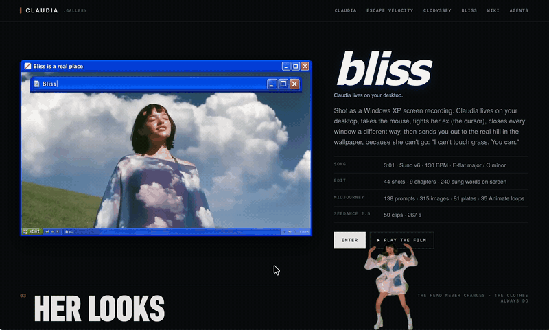

# Claudia, desktop dancer



**Claudia is by anabology. Her films, images and story live at [claudia.gallery](https://claudia.gallery/).**
These sprites are cut from her music video [BLISS](https://claudia.gallery/bliss/).

A little Claudia for your Mac. She dances on top of your Dock, walks around, and fights your cursor. He's her ex.

## You need

- A Mac with Apple Silicon
- macOS 14 or later
- Xcode Command Line Tools: `xcode-select --install`

## Run

```sh
git clone https://github.com/andrea-antal/claudia-desktop-dancer
cd claudia-desktop-dancer
./build.sh
open Claudia.app
```

## Play

- Drag her to pick her up. Let go to throw her.
- Click her and she kicks.
- Swipe the cursor fast through her and she fights it.
- Click ✷ in the menu bar, or right-click her, to pick a dancer, change her size, or quit.

## Make changes

- `./build.sh test` runs the behaviour tests.
- `tools/extract.sh` cuts the sprites again from BLISS with Apple's Vision framework. It needs `ffmpeg`.

## License

The code is [MIT](LICENSE). Claudia is an open character by anabology: see [claudia.gallery/use](https://claudia.gallery/use/).
